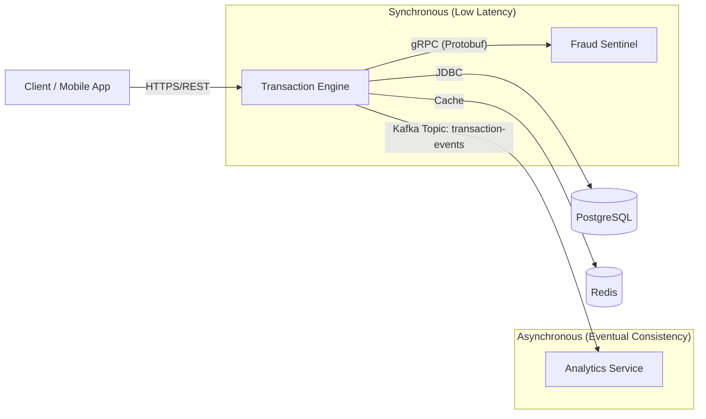

# FinGuard: High-Frequency Transaction & Fraud Detection Platform

**FinGuard** is an enterprise-grade financial transaction processing system designed for **high throughput** and **low latency**. It simulates a core banking ledger capable of handling thousands of concurrent requests using **Java 21 Virtual Threads**, vetting transactions via **gRPC** for sub-millisecond fraud detection, and broadcasting state changes via **Apache Kafka** for real-time analytics.

## 🚀 Architecture Overview

The system follows a **Domain-Driven Design (DDD)** approach within a **Microservices Architecture**:



## 🛠️ Tech Stack

- **Core Backend**: Java 21, Spring Boot 3.2
- **Concurrency**: Java Virtual Threads (Project Loom) for non-blocking I/O
- **Communication**:
  - Internal: gRPC (Protobuf) for high-performance inter-service communication
  - External: REST API (Spring Web)
- **Event Bus**: Apache Kafka for decoupled, event-driven architecture
- **Data Layer**: PostgreSQL (Transactional), Redis (Caching)
- **Build Tool**: Maven (Monorepo strategy)
- **Containerization**: Docker & Docker Compose

## 🧩 Microservices

| Service | Port | Description |
|---------|------|-------------|
| **Transaction Engine** | 8081 | The "Body". Handles REST requests, manages ledger state, persists to Postgres. Uses Virtual Threads to handle high concurrency and Resilience4j for rate limiting. |
| **Fraud Sentinel** | 9090 | The "Brain". A gRPC server that validates transactions against fraud rules (e.g., amount limits, blacklists). |
| **Analytics Service** | 8082 | The "Observer". Consumes transaction-events from Kafka to update real-time dashboards (simulated). |
| **Proto Common** | N/A | Shared library containing Protocol Buffer definitions (.proto) and generated Java code. |

## ⚡ Key Features

### Virtual Threads over Reactive
Leveraged Java 21's Virtual Threads to achieve the throughput of Reactive programming (WebFlux) while maintaining the simplicity of the imperative programming model.

### gRPC over REST for Internal Calls
Replaced standard HTTP/REST calls between the Transaction Engine and Fraud Sentinel with gRPC. This reduces payload size (binary Protobuf) and eliminates HTTP/1.1 overhead, critical for latency-sensitive financial checks.

### Event-Driven Consistency
The system uses the "Outbox Pattern" concept. Once a transaction is committed to the database, an event is published to Kafka. This decouples the core ledger from downstream consumers like Analytics.

### Resilience & Self-Protection
Implemented Resilience4j Rate Limiting directly on the Transaction Engine to protect the ledger from traffic spikes (Token Bucket algorithm), ensuring stability without an external Gateway.

## 🏃‍♂️ Getting Started

### 1. Infrastructure Setup
Spin up the data layer (Postgres, Kafka, Zookeeper) using Docker.

```bash
docker-compose up -d
```

### 2. Build the Platform
This project uses a Maven Monorepo strategy. Build the shared libraries and services in order.

```bash
mvn clean install -DskipTests
```

### 3. Run the Services
You will need 3 separate terminal windows.

**Terminal 1: Fraud Sentinel (gRPC Server)**
```bash
cd backend/fraud-sentinel
mvn spring-boot:run
```

**Terminal 2: Transaction Engine (REST API)**
```bash
cd backend/transaction-engine
mvn spring-boot:run
```

**Terminal 3: Analytics Service (Kafka Consumer)**
```bash
cd backend/analytics-service
mvn spring-boot:run
```

**Terminal 4: Frontend Dashboard**
```bash
cd frontend/banking-dashboard
npm start
```

Access UI at http://localhost:4200

## 🧪 Testing the API

### Scenario 1: Legitimate Transaction (< $10,000)
**Expected Result**: HTTP 200 OK, Status: APPROVED

```bash
curl -X POST http://localhost:8081/api/v1/transactions \
  -H "Content-Type: application/json" \
  -d '{ 
    "accountId": "ACC-GOOD-001", 
    "amount": 500.00, 
    "currency": "USD", 
    "referenceId": "TXN-001" 
  }'
```

### Scenario 2: Fraudulent Transaction (> $10,000)
**Expected Result**: HTTP 200 OK, Status: REJECTED

```bash
curl -X POST http://localhost:8081/api/v1/transactions \
  -H "Content-Type: application/json" \
  -d '{ 
    "accountId": "ACC-FRAUD-999", 
    "amount": 15000.00, 
    "currency": "USD", 
    "referenceId": "TXN-FRAUD" 
  }'
```
